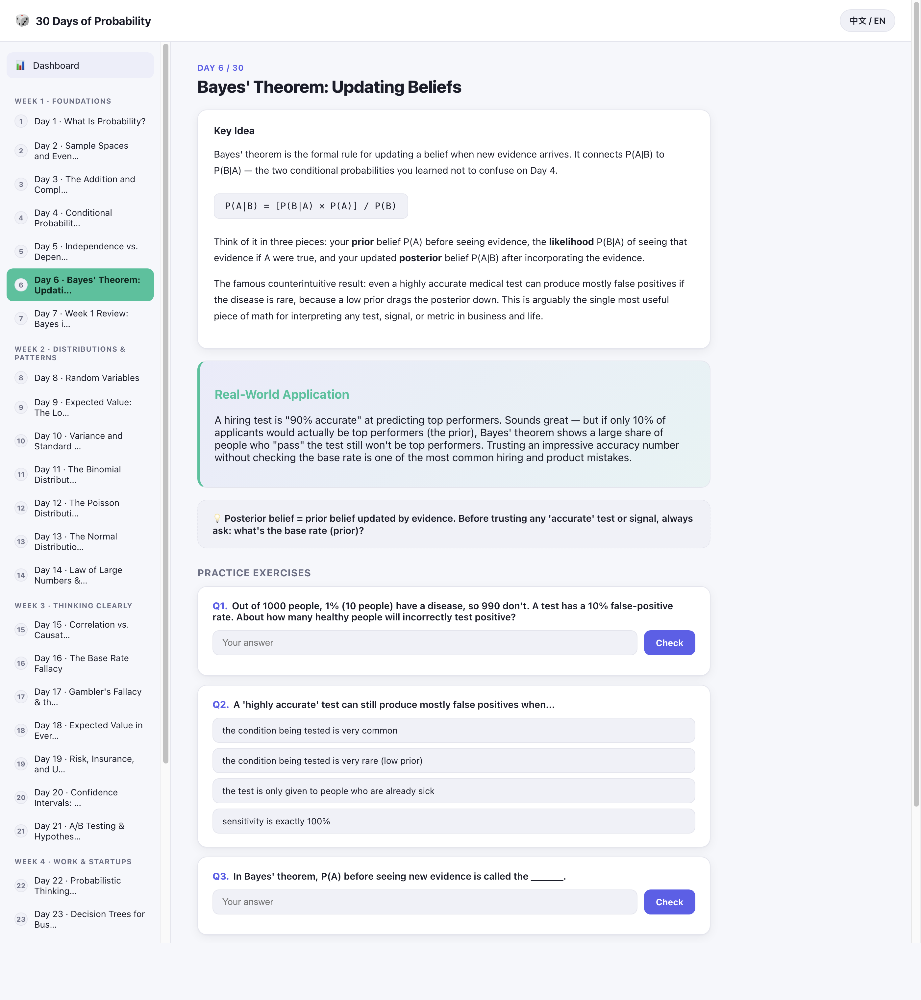
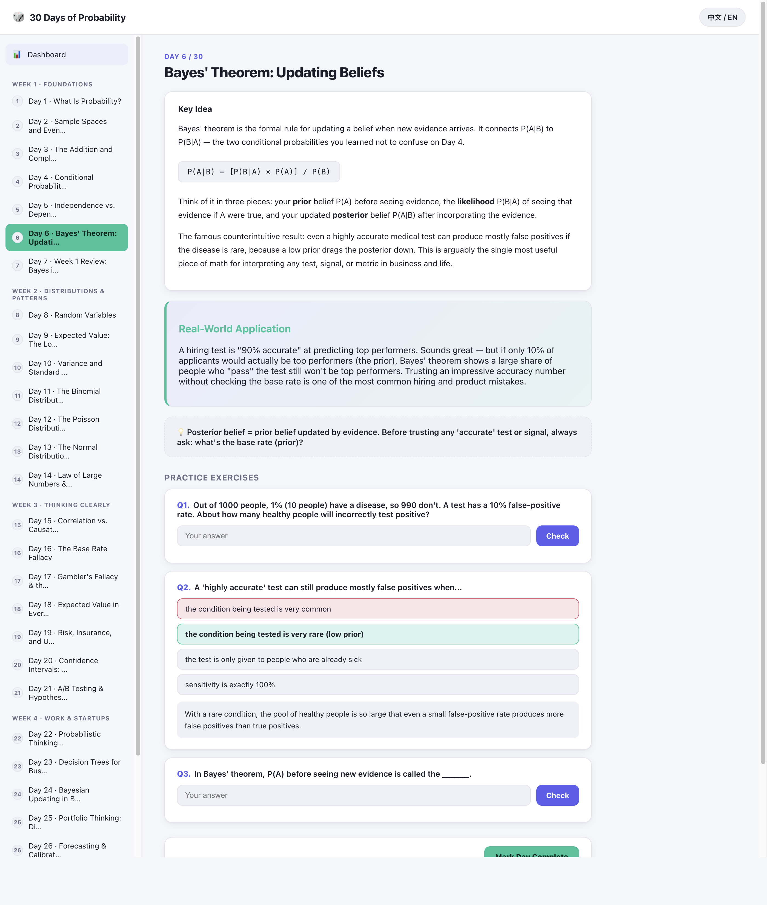
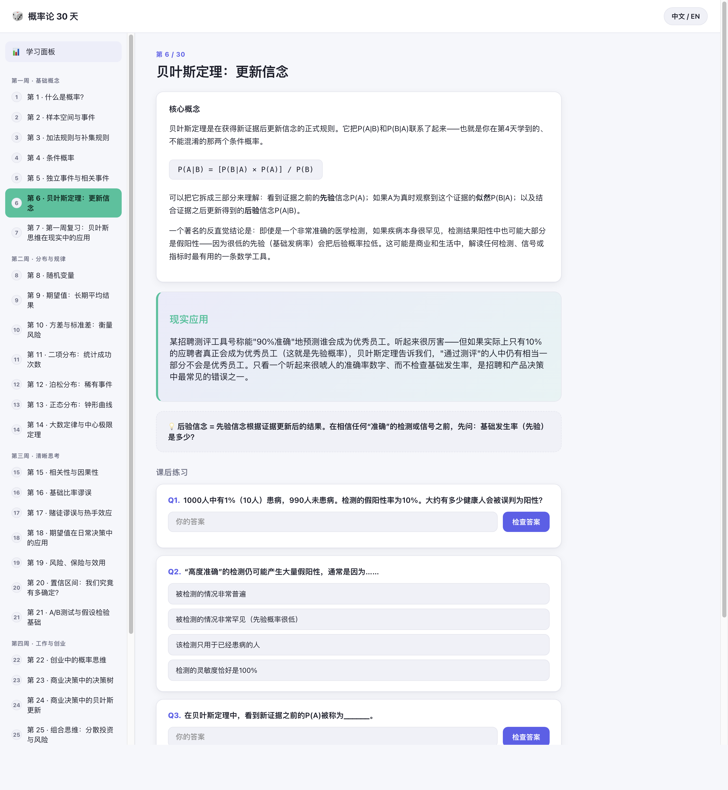

# 🎲 30 Days of Probability

Learn to think in probabilities, not certainties. **30 Days of Probability** is a free, bilingual, browser-only course that teaches probability theory through the decisions you actually face — pricing a risk, reading an A/B test, sizing a bet — instead of abstract formulas. Open it and start Day 1 in under a minute.

## ✨ Highlights

- 📅 **30 bite-sized lessons** across 4 themed weeks
- 🌐 **Fully bilingual** — switch between English and 中文 anytime
- 🧠 **Interactive quizzes** with instant feedback after every lesson
- 📊 **Progress dashboard** — streaks, completion, quiz accuracy, saved in your browser
- ⚡ **Zero setup** — pure HTML/CSS/JS, no build step, no dependencies, no server

## 🚀 Live Demo

👉 **[Try it now](https://fuzhongyuan504-ship-it.github.io/probability-30-days/)** — no install required.

## 📸 Screenshots

| Dashboard | Lesson |
|---|---|
|  |  |

| Quiz Feedback | Language Switch |
|---|---|
|  |  |

## 🤔 Why this project?

Most probability resources open with formulas. This one opens with decisions: should you buy the extended warranty, trust a two-day A/B test, take the acquisition offer? Each lesson builds intuition first with a real-world example from everyday life, work, or startups, then introduces just enough math to reason about it — not a semester of proofs.

## 🛠️ How to use it

```bash
git clone https://github.com/fuzhongyuan504-ship-it/probability-30-days.git
cd probability-30-days
open index.html      # macOS
# or double-click index.html in Finder / Explorer
```

Your progress and language preference are saved automatically in the browser's local storage — close the tab and come back anytime.

## 📁 Project structure

```
index.html          Dashboard + lesson viewer shell
css/style.css        All styling (light/dark aware)
js/app.js             Rendering, progress tracking, quiz logic
js/i18n.js             English/Chinese UI strings
data/week1.js         Days 1-7:   Foundations
data/week2.js         Days 8-14:  Distributions & Patterns
data/week3.js         Days 15-21: Thinking Clearly
data/week4.js         Days 22-30: Work & Startups (capstone on Day 30)
```

## 📚 Curriculum overview

| Week | Days | Focus |
|---|---|---|
| 1 · Foundations | 1–7 | Probability basics, conditional probability, independence, Bayes' theorem |
| 2 · Distributions & Patterns | 8–14 | Random variables, expected value, variance, binomial/Poisson/normal distributions, Law of Large Numbers |
| 3 · Thinking Clearly | 15–21 | Correlation vs. causation, base rate fallacy, gambler's fallacy, risk & utility, confidence intervals, A/B testing |
| 4 · Work & Startups | 22–30 | Startup success estimation, decision trees, Bayesian updating in business, portfolio thinking, black swans, negotiation, capstone framework |

## 🗺️ Roadmap

**Done**
- [x] 30-day bilingual curriculum (EN/中文)
- [x] Interactive quizzes + progress dashboard
- [x] Live demo via GitHub Pages

**Planned**
- [ ] Downloadable / printable lesson summaries
- [ ] Additional community-contributed language tracks
- [ ] Manual light/dark theme toggle (currently follows system setting)

## 🤝 Contributing

This repo's `main` branch is maintained by the author and stays close to the original curriculum — only the maintainer can push here.

- 🐛 **Small improvements** — bug fixes, accessibility, UI polish, translations, typo fixes — are welcome via Pull Request.
- 🎨 **Larger curriculum changes** — new topics, restructured lessons, major redesigns — are better suited to a **fork**, so both versions can live independently.

Fork ideas:
- A version for a different subject (statistics, game theory, negotiation) reusing the same engine
- Extra language tracks beyond English/Chinese
- Alternate or expanded exercise sets
- A new visual theme

### 🌱 Good first contributions

- Fix a typo or unclear sentence in a lesson
- Improve mobile responsiveness or accessibility (alt text, contrast, keyboard nav)
- Add a new quiz question to an existing lesson
- Translate the UI strings into a third language

## 💛 Support

If this project helped you, consider:

⭐ **Starring** the repo · 🍴 **Forking** it to make your own version · 📣 **Sharing** it with someone learning probability

## 👤 About the author

Built by **Zhongyuan Fu**, who's interested in AI-powered education and building interactive tools that make learning stick.

## 📄 License

MIT — see [LICENSE](LICENSE). Free to use, modify, fork, and share, including for commercial purposes, as long as the original copyright notice is retained.
