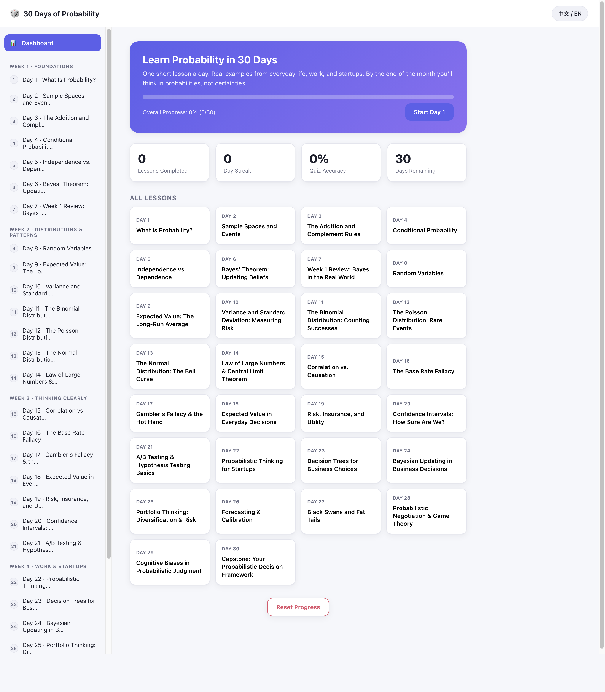

# 30 Days of Probability · 概率论 30 天

A free, self-contained website that teaches probability theory in 30 daily lessons — grounded in real examples from everyday life, work, and startups. No install, no backend, no account. Just open it and start Day 1.

一个完全静态、免费的网站，用30节每日课程教你概率论——每一课都结合日常生活、工作和创业中的真实案例。无需安装、无需后端、无需注册，打开即可开始第一天的学习。



## Features · 功能

- **30 daily lessons** across 4 themed weeks: Foundations → Distributions & Patterns → Thinking Clearly → Work & Startups
  **30节每日课程**，分为4个主题周：基础概念 → 分布与规律 → 清晰思考 → 工作与创业
- **Bilingual, switchable anytime** — every lesson, exercise, and UI label exists in both English and Chinese
  **中英双语，随时切换**——每一课、每道练习题、每个界面文案都提供中英两种版本
- **Progress dashboard** — tracks completed lessons, day streak, and quiz accuracy, saved locally in your browser
  **学习进度面板**——追踪已完成课程数、连续学习天数和练习正确率，数据保存在本地浏览器中
- **Interactive exercises** after every lesson, with instant feedback and explanations
  **每课配有课后练习题**，作答后即时反馈并附解析
- **Zero setup** — pure HTML/CSS/JS, no build step, no dependencies, no server required
  **零配置**——纯HTML/CSS/JS实现，无需构建、无第三方依赖、无需服务器

## How to use it · 使用方法

Just open `index.html` in any modern browser:

直接用浏览器打开 `index.html` 即可：

```bash
git clone https://github.com/<your-username>/probability-30-days.git
cd probability-30-days
open index.html      # macOS
# or double-click index.html in Finder / Explorer
```

Your progress and language preference are saved automatically in the browser's local storage — close the tab and come back anytime.

你的学习进度和语言偏好会自动保存在浏览器本地存储中——随时关闭页面，下次打开时会自动恢复。

## Project structure · 项目结构

```
index.html        Dashboard + lesson viewer shell
css/style.css      All styling (light/dark aware)
js/app.js          Rendering, progress tracking, quiz logic
js/i18n.js         English/Chinese UI strings
data/week1.js      Days 1-7:   Foundations
data/week2.js      Days 8-14:  Distributions & Patterns
data/week3.js      Days 15-21: Thinking Clearly
data/week4.js       Days 22-30: Work & Startups (capstone on Day 30)
```

## Curriculum overview · 课程大纲

| Week | Days | Focus |
|---|---|---|
| 1 · Foundations | 1–7 | Probability basics, conditional probability, independence, Bayes' theorem |
| 2 · Distributions & Patterns | 8–14 | Random variables, expected value, variance, binomial/Poisson/normal distributions, Law of Large Numbers |
| 3 · Thinking Clearly | 15–21 | Correlation vs. causation, base rate fallacy, gambler's fallacy, risk & utility, confidence intervals, A/B testing |
| 4 · Work & Startups | 22–30 | Startup success estimation, decision trees, Bayesian updating in business, portfolio thinking, black swans, negotiation, capstone framework |

## License · 许可

Free to use, modify, and share for personal or educational purposes.

可自由用于个人学习或教育用途，欢迎修改与分享。
